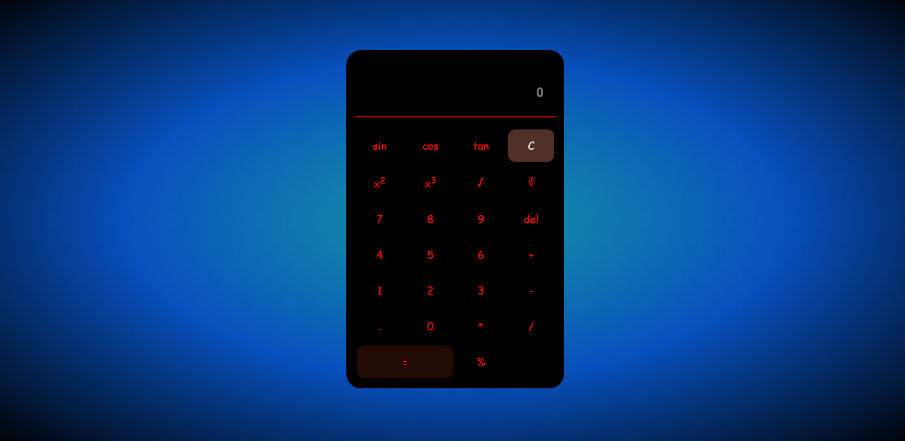
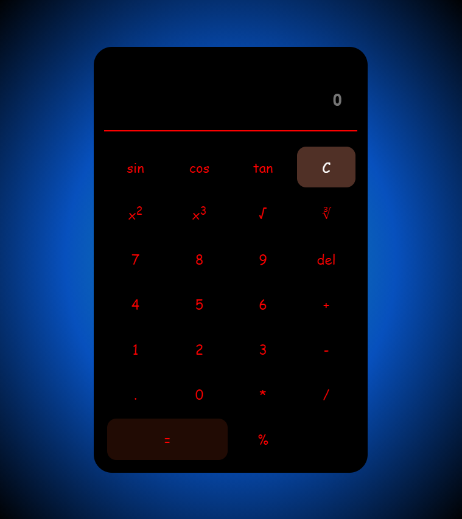
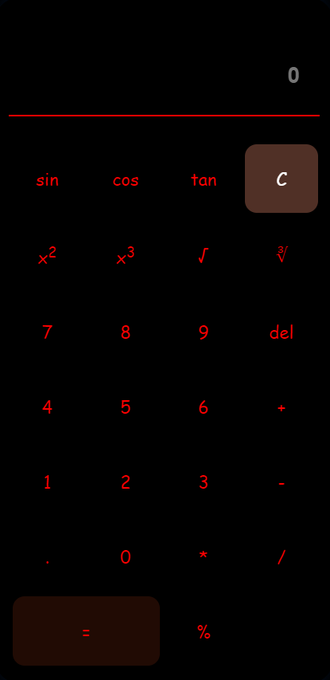

# Scientific-Calculator

Mini project that I've been working on.

Even thou this is a simple project I tried to respect all proper ways and rules of writing clean code,
So files are already very performance friendly and it is responsive.

In further versions of this project I plan to add more functions, 
As well as options to save some calculated numbers to be used again.

Style.css = "autoprefixer", "css-nano" 
Script.js = "concat", "babel", "terser"

